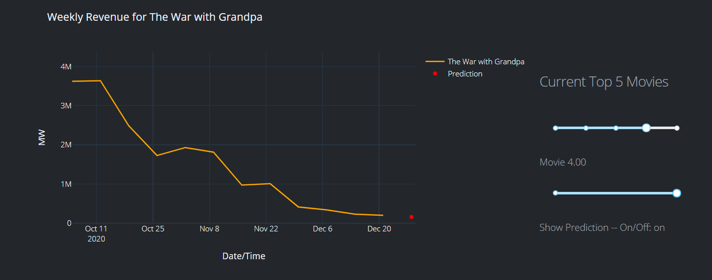
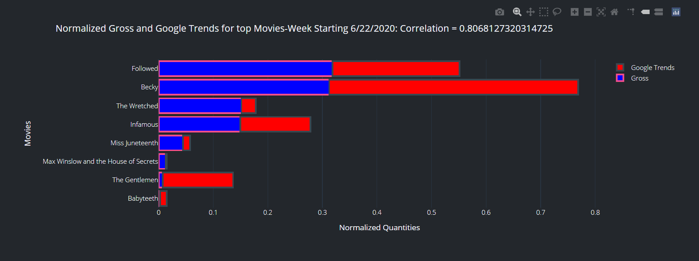
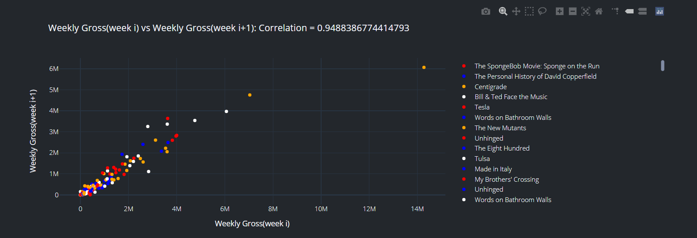

# Charting The Charts

### Project Overview   
Charting the Charts is a tool to utilize the potential predictive power of online trending data to predict future revenue trends for new movie releases.  The data used in this model is retrieved from two data sources. The BoxOfficeMojo data is scraped and the Google Trends data is available through gtab.  Our database updates automatically every Tuesday with the previous week of data.  A random forest model is used to predict revenue for the upcoming week.  The live app can be viewed here: [Charting the Charts](https://charting-the-charts.herokuapp.com/)

### Language, Packages and Resources Used
**Language:**  Python 3.8.3  
**Packages:** dash, matplotlib, numpy, pandas, plotly, pymongo, requests, ipywidgets, notebook, expiringdict, datetime, sklearn, schedule, beautifulsoup4, bs4, gtab, gunicorn, gspread, df2gspread, oauth2client  
**Resources:** partially adapted from https://github.com/BrownDSI/data1050-demo-project-f20  

### Visualizations  
Below are a selection of visualizations from the app  

The sliders on the app allow a user to toggle between the top five movies for the current week and to toggle the prediction on/off

The correlation between Google Trends data and movie gross can be seen in a stacked bar plot

Unsurprisingly the strongest correlation for current gross is gross from the previous week 

### Overview of App Architecture
The Python file app.py controls the main layout.  All of the code for the visualizations and interactive features are here.  The main page calls model.py to return the pretrained model to make predictions for the upcoming week which is used in the visualization seen above.  The app is hosted on Heroku so the Heroku scheduler is being used to call update_data.py everynight.  If datetime.datetime.today().weekday() == 1 evaluates to true(meaning it is currently tuesday) then the dataset is updated.  We call it everyday because Heroku has no functionality for weekly scheduled tasks.  Tuesday was chosen because this is the day when all data from the previous week(Mon-Sun) is available.  The dataset which is hosted in Google Sheets(because it is fairly small) is retrieved through the Sheets API and converted into a dataframe and the new data which is scraped from BoxOfficeMojo and pulled from gtab(Google Trends) are combined and pushed back to Google Sheets.  
